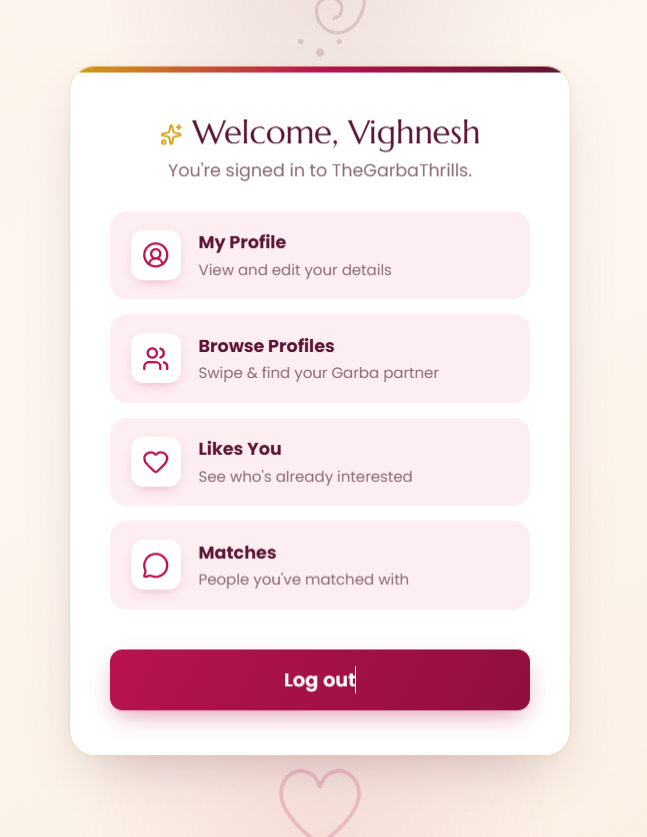
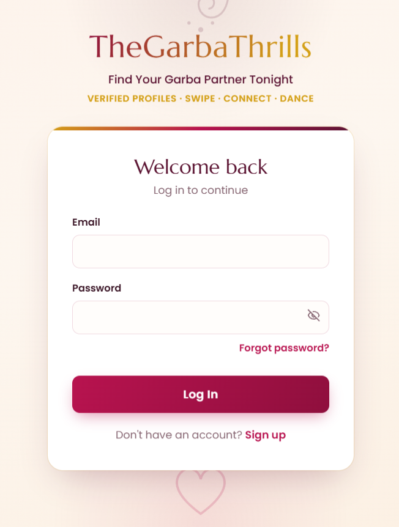
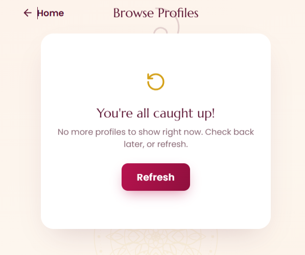
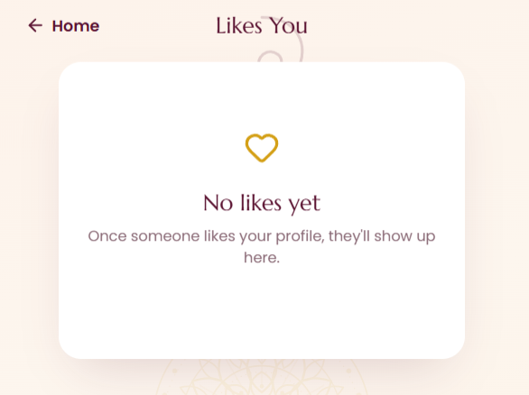
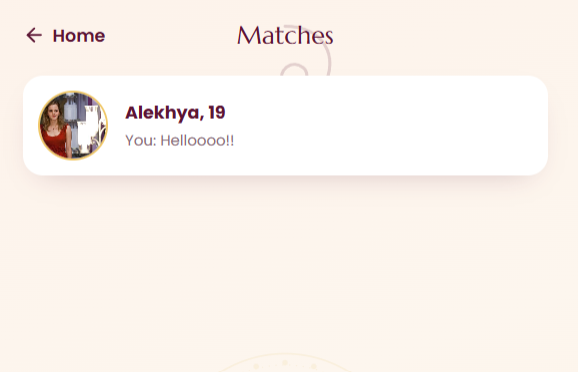
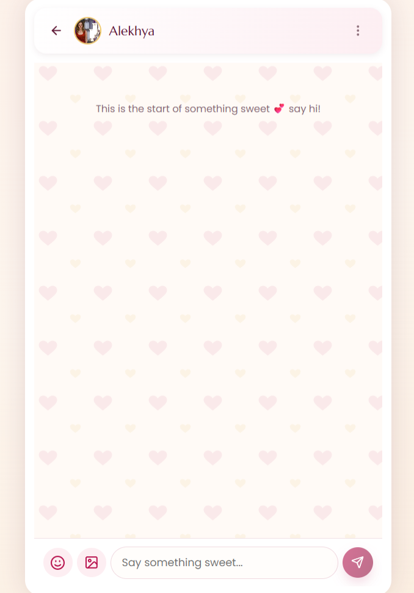
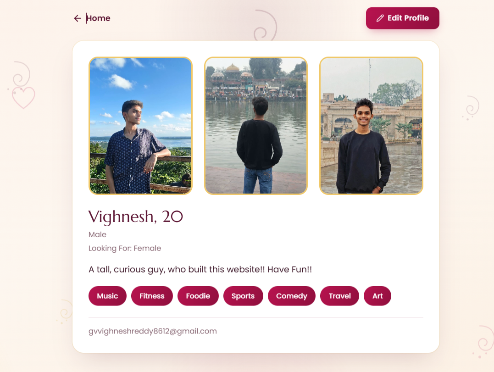

# 💃🕺 TheGarbaThrills

**A Garba-night matchmaking app, built for VIT Bhopal's Navratri season.**

Swipe, match, and chat with fellow students before you hit the dance floor. Built solo, ground-up, with zero budget — powered entirely by free-tier infrastructure.

---

## ✨ Features

- **Swipe-based matching** — like/pass deck with mutual-interest filtering (gender + "looking for" preferences)
- **Real-time-feel chat** — text messages, custom Garba-themed stickers, and GIF search (via Giphy), with unread badges and read receipts
- **Rich profiles** — up to 3 photos, bio, and interest tags (Garba, Dandiya, Bollywood, and more), with public view-only profile pages
- **Safety first** — block and report system with silent-blocking (blocked users are never notified) and reason-tagged reports
- **Secure auth** — JWT-based sessions via httpOnly cookies, bcrypt password hashing, and email-based password reset
- **Festive, original design** — a custom "romantic + royal" visual theme with hand-built SVG art (mandalas, diyas, dandiya sticks) — no stock assets, no copyright risk

## 🛠 Tech Stack

| Layer | Technology |
|---|---|
| Frontend | React + TypeScript + Vite |
| Backend | Node.js + Express + TypeScript |
| Database | MongoDB Atlas (free M0 tier) |
| Photo Storage | Supabase Storage |
| Email | Resend |
| GIFs | Giphy API (server-proxied) |
| Auth | JWT (httpOnly cookies) + bcrypt |
| Frontend Hosting | Vercel |
| Backend Hosting | Northflank |

Every service in this stack runs on a free tier with no credit card required — built for a solo dev on a zero budget, launched in time for Navratri.

## 📸 Screenshots

| Welcome | Sign In | Browse Profiles |
|---|---|---|
|  |  |  |

| Likes You | Matches | Chat |
|---|---|---|
|  |  |  |

| Profile |
|---|
|  |

## 📁 Project Structure

This is a monorepo containing both the frontend and backend as independent, separately-deployed apps:

```
TheGarbaThrills/
├── garbathrills-backend/
│   ├── src/
│   │   ├── config/                # DB and Supabase client setup
│   │   │   ├── db.ts
│   │   │   └── supabase.ts
│   │   ├── constants/              # Shared enums/lists
│   │   │   ├── interests.ts        # Interest tag options
│   │   │   └── stickers.ts         # Sticker ID list (original SVG art)
│   │   ├── controllers/            # Route handler logic
│   │   │   ├── authController.ts
│   │   │   ├── blockController.ts
│   │   │   ├── chatController.ts
│   │   │   ├── matchController.ts
│   │   │   ├── profileController.ts
│   │   │   ├── reportController.ts
│   │   │   └── swipeController.ts
│   │   ├── middleware/
│   │   │   ├── auth.ts             # JWT cookie verification
│   │   │   └── upload.ts           # Multer photo upload handling
│   │   ├── models/                 # Mongoose schemas
│   │   │   ├── User.ts
│   │   │   ├── Swipe.ts
│   │   │   ├── Match.ts
│   │   │   ├── Message.ts
│   │   │   ├── Block.ts
│   │   │   ├── Report.ts
│   │   │   ├── ClearedChat.ts
│   │   │   └── ReadReceipt.ts
│   │   ├── routes/                 # Express route definitions
│   │   │   ├── auth.ts
│   │   │   ├── profile.ts
│   │   │   ├── swipe.ts
│   │   │   ├── matches.ts
│   │   │   ├── chat.ts
│   │   │   ├── block.ts
│   │   │   └── report.ts
│   │   ├── utils/
│   │   │   ├── blockHelpers.ts     # isBlockedEitherWay(), getExcludedUserIds()
│   │   │   ├── email.ts            # Resend email sending
│   │   │   └── supabaseStorage.ts  # Photo upload/resize/delete helpers
│   │   └── index.ts                # App entry point
│   ├── package.json
│   ├── tsconfig.json
│   └── README.md                   # Backend setup & full API reference
│
└── garbathrills-frontend/
    ├── src/
    │   ├── assets/                 # Static images (hero art, icons)
    │   ├── components/
    │   │   ├── AuthBrandHeader.tsx
    │   │   ├── ConfirmDialog.tsx       # Generic reusable confirmation modal
    │   │   ├── FestiveBackgroundArt.tsx # Original SVG mandala/diya/paisley art
    │   │   ├── GifPicker.tsx           # Debounced Giphy search
    │   │   ├── InterestTagPicker.tsx
    │   │   ├── MatchModal.tsx          # New-match celebration overlay
    │   │   ├── PhotoManager.tsx        # Shared photo upload/remove UI
    │   │   ├── ProtectedRoute.tsx      # Auth-gated route wrapper
    │   │   ├── Sticker.tsx
    │   │   └── StickerPicker.tsx
    │   ├── context/
    │   │   └── AuthContext.tsx     # Global auth state
    │   ├── lib/
    │   │   └── api.ts              # Axios instance, API calls
    │   ├── pages/
    │   │   ├── SignUp.tsx
    │   │   ├── Login.tsx
    │   │   ├── ForgotPassword.tsx
    │   │   ├── ResetPassword.tsx
    │   │   ├── ProfileSetup.tsx    # Forced onboarding, no back button
    │   │   ├── Profile.tsx         # Own profile, inline edit
    │   │   ├── ViewProfile.tsx     # Read-only public profile view
    │   │   ├── Home.tsx            # Main menu
    │   │   ├── SwipeDeck.tsx
    │   │   ├── LikesYou.tsx
    │   │   ├── Matches.tsx         # Match list w/ previews & unread badges
    │   │   └── ChatWindow.tsx      # Full chat UI — search, block, clear, GIFs
    │   ├── App.css                 # ~1700+ lines, festive theme styling
    │   ├── App.tsx                 # Route definitions
    │   └── main.tsx
    ├── package.json
    ├── vite.config.ts
    └── README.md                   # Frontend setup & pages reference
```

- 👉 [Backend setup & API reference](./garbathrills-backend/README.md)
- 👉 [Frontend setup & pages reference](./garbathrills-frontend/README.md)

## 🚀 How It's Deployed

- **Frontend** → Vercel, root directory `garbathrills-frontend`
- **Backend** → Northflank, root directory `garbathrills-backend`
- **Database** → MongoDB Atlas, Mumbai region
- **Photos** → Supabase Storage bucket `GarbaThrills-Photos` (public, 2MB limit, images pre-resized to 1000×1000 before upload)

See each subfolder's README for full deployment steps and environment variables.

## 🔒 Core App Flow

1. **Sign up** → verify via email → build your profile (photos, bio, interests)
2. **Swipe** → browse profiles filtered by mutual preference, like or pass
3. **Match** → when two users like each other, a match is created and a chat unlocks
4. **Chat** → text, stickers, or GIFs — with read receipts and unread counts
5. **Safety** → block or report anyone, anytime, with zero friction

## 📌 Status

All core phases are complete and the app is deployed to production:

- ✅ Authentication
- ✅ Profile creation & editing
- ✅ Swipe, match, likes, and filters
- ✅ Chat (text, stickers, GIFs)
- ✅ Block & report
- ✅ Testing & deployment

---

Built solo, with a lot of debugging and zero budget. Happy Garba! 🪔
